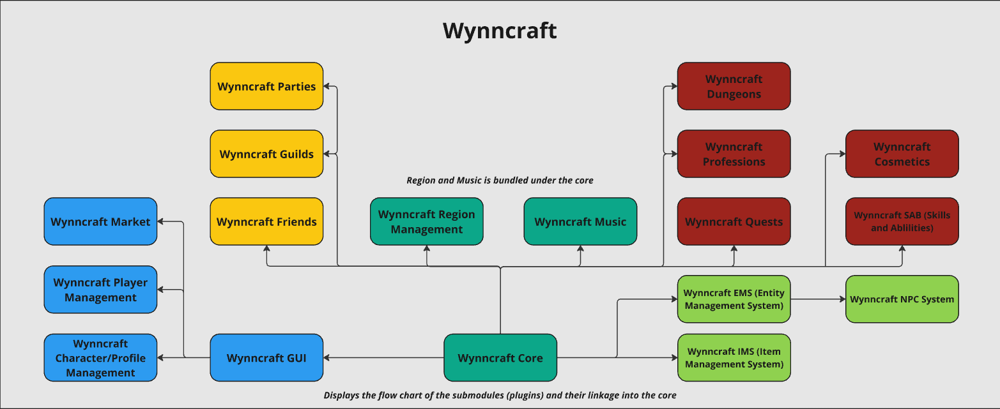

# Wynncraft
[Wynncraft](https://wynncraft.com/) is one of the largest MMORPG of Minecraft. This repository contains code that attempts to recreate nearly every aspect if the server in its current state. The plugin is written in Java and is based on the Bukkit/Paper API.

## Licensing
`Why doesn't this have a restrictive license?`
 
Great question! This repository does not contain a license at this point of time because this is a recreation of the Wynncraft core functionality. I **did not** create the ideas or aspects of the actual server and I wish to give all credit to the developers of Wynncraft when possible.

It currently does contain a license though to ensure that the code is not used in a malicious way and that the liability doesn't fall onto contributors or the author of this repository. This repository currently falls under the [MIT License](https://github.com/IanTapply22/Wynncraft/blob/main/LICENSE.md)

## Roadmap and Progress
Aren't sure when a new release will be published or what's planned for this project? Please see the [Project Board/Planner](https://github.com/users/IanTapply22/projects/8) to view the progress, roadmap, backlog, and reported bugs associated with the project. The board is updated frequently and is the go-to place to view the status of this project.

## Future Module Linkage
Currently, Wynncraft is designed as an AIO (all-in-one) plugin to promote ease-of-use and to make it a one-step process to install. With that being said, we are looking to diverge away from this system and split up modules into separate plugins to keep our codebase readable and clean. You can find a model of the module linkage flow chart below.

## Contributing
Before contributing to the project, please read the [Code of Conduct](https://github.com/IanTapply22/Wynncraft/blob/main/CODE_OF_CONDUCT.md)

The Wynncraft open-source project is open to contributions from anyone. If you wish to contribute to the project, please see the [CONTRIBUTING.md](https://github.com/IanTapply22/Wynncraft/blob/main/CONTRIBUTING.md) file for more information on how to contribute to the project.
 
Some ways to contribute to the project include:
- Reporting bugs or issues to our [Issue Tracker](https://github.com/IanTapply22/Wynncraft/issues?q=is%3Aissue+is%3Aopen+sort%3Aupdated-desc)
- Contributing to the evolving [Wiki](https://github.com/IanTapply22/Wynncraft/wiki)
- Submitting a request for a missing feature or enhancement, or even by creating a [pull request](https://github.com/IanTapply22/Wynncraft/pulls?q=is%3Apr+is%3Aopen+sort%3Aupdated-desc) with the feature or bug fix
